<!-- START doctoc generated TOC please keep comment here to allow auto update -->
<!-- DON'T EDIT THIS SECTION, INSTEAD RE-RUN doctoc TO UPDATE -->
**Table of Contents**  *generated with [DocToc](https://github.com/thlorenz/doctoc)*

- [Regular Expression Fundamentals](#regular-expression-fundamentals)
  - [References](#references)
  - [Fundamentals](#fundamentals)
    - [Definition](#definition)
    - [How It Works](#how-it-works)
      - [1. Pattern](#1-pattern)
      - [2. Regex](#2-regex)
      - [3. Subject and Function](#3-subject-and-function)
      - [4. Engine](#4-engine)
  - [Building Your First Regex](#building-your-first-regex)
    - [Visualization](#visualization)
    - [Basic Syntax Summary](#basic-syntax-summary)
  - [Syntax in Detail](#syntax-in-detail)
    - [Engines, Dialects, Influencers](#engines-dialects-influencers)
    - [Matching Characters](#matching-characters)
    - [Meta Characters - Character Classes](#meta-characters---character-classes)
    - [Meta Characters - Wildcard](#meta-characters---wildcard)
    - [Meta Characters - Quantifiers and Greediness](#meta-characters---quantifiers-and-greediness)

<!-- END doctoc generated TOC please keep comment here to allow auto update -->

# Regular Expression Fundamentals

> My notes from Pluralsight [course](https://app.pluralsight.com/library/courses/regular-expressions-fundamentals/table-of-contents)

## References

Visualizer: https://regexper.com/

Tester one at a time: https://www.regextester.com/

Tester multiple: https://regexr.com/

Also: Proprietary html/js tool provided by instructor in Exercise files.

Module 2:
Testing: proprietary, included in the exercise files.
Visualisation: https://regexper.com/

Module 3:
Clip 4: http://myregexp.com/
Clip 6: https://regex101.com/
Clip 7: http://www.rexv.org/
Clip 8: http://regexhero.net/
Clip 9: http://rubular.com/

Module 4:
Clip 1: https://sourceforge.net/projects/regexbuilder/
Clip 2: https://regex101.com/
Clip 3: http://www.weitz.de/regex-coach/

## Fundamentals

### Definition

A sequence of characters that define a search pattern.

Focus on "pattern recognition", eg of patterns:

* car license plates
* support ticket numbers
* postal codes
* dates
* email addresses
* url
* airport codes
* bar codes
* credit card numbers
* bank account numbers
* addresses
* country codes

**Typical Uses**

* input validation
* search/replace
* string parsing
* data scraping
* syntax highlighting
* data mapping

To perform above, need to be able to transform patterns in data into regular expressions.

**Users of Regex**

* developers working with strings in IDEs
* data professionals to query data
* sysadmins working with file system, server directives

Supported by pretty much every programming language (exception Assembly).

**Regex Standards**

* POSIX: Portable Operating System Interface for uniX
* BRE (POSIX): Basic Regular Expressions
* ERE (POSIX): Extended Regular Expressions
* PCRE: Perl Compatible Regular Expressions

### How It Works

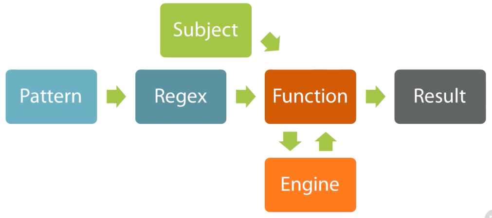

#### 1. Pattern

First need to determine the Pattern that you want to match. May need to read docs, RFC's, legal docs to figure out what the rules are.

Eg: What are the pattern rules for an email address?

Numerous RFCs that define composition of email address including: 821, 822, 1035, 1123, 2142, 2821, 2822, 3696, 4291, 5321, etc. Potentially some have conflicts with each other. Have to know which RFC supersedes the other in case of a conflict.

#### 2. Regex

Second, translate the pattern rules into a Regex pattern. Need to decide how far the regex will go in matching some or all of pattern rules.

Example of email matching regex meeting rules of RFC 5321:

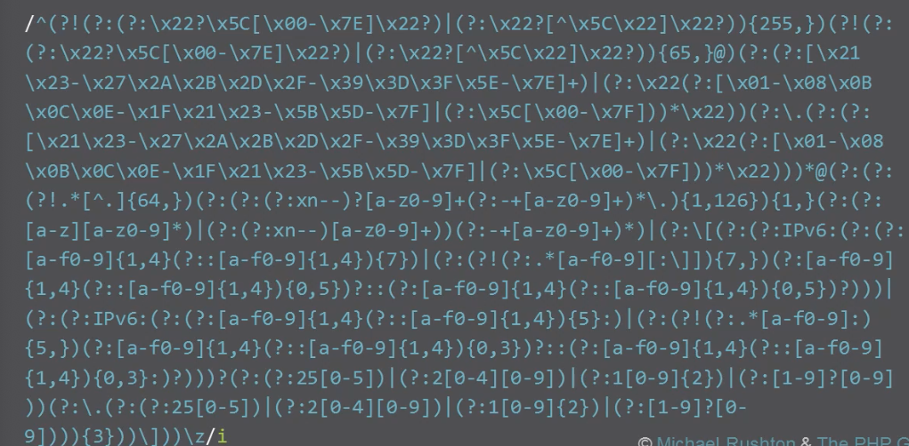

Above matches many edge cases defined in RFC, but that are rarely encountered in actual in the real world.

Another option would be to use a simpler regex that doesn't catch all edge cases.

Example, this one is just basic email validation, does not allow i8n domains, but is flexible for new TLDs:

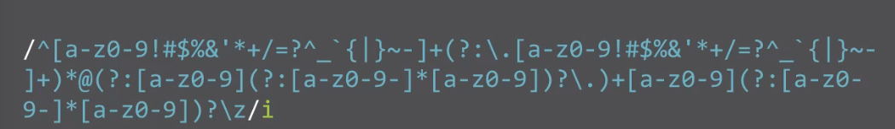

The simpler regex is "good enough", and more maintainable.

#### 3. Subject and Function

Third, send some sample text (string or group of strings) to be tested, called the "Subject" or Input, and the Regex defined in previous step into a Function.

The Subject could be any data source such as input from a form, result of database query or API call, info from a file system, etc.

Note that regex was originally defined for "regular languages", may not work so well in [ideographic based languages](https://dailyjustnow.com/en/what-is-an-ideographic-language-25317/), eg: Chinese, Japanese. But last few years have improved unicode support.

#### 4. Engine

The Function (which receives a test Subject and Regex pattern) goes to the regex Engine. The Engine compiles the Regex, evaluates the Subject (string) against the Regex, and returns a result to the Function, which in turn returns that Result to the caller of the Function.

**Result Types**

The type of result used depends on the Function used. The result type could be one of:

* Boolean: Does it match?
* Integer: How many matches have been found?
* Array: What are the matches?

How about position of match(es)?

## Building Your First Regex

Example: Building a CMS that allows user to change background color of pages. CSS color example: `#eded84`, which would come from a color picker component. Want to validate that the color string received from picker component is a valid CSS color/hex value.

**The Pattern**

Generally a CSS color code using hex notation:

* starts with a hash
* followed by 6 characters
* each character must be in range A through F, and/or 0 through 9
* 3 sets of two character codes build up the Red, Green, and Blue values

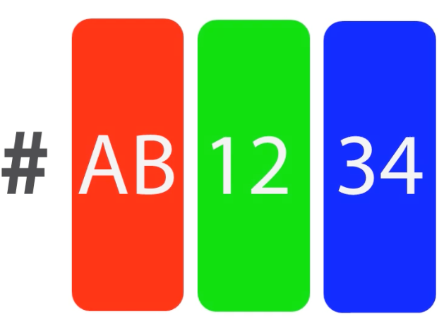

`#AB1234`

**Regex**

Every combination between # and 0 repeated 6 times and F repeated 6 times is valid.

Regex based on this pattern:

```
/#[ABCDEF0123456789]/
```

Square brackets used to group a *range* of acceptable characters.

Forward slashes are *delimiters* to indicate the start and end of the regex.

Testing this on subject `#AB1234` only matches on `#A`:

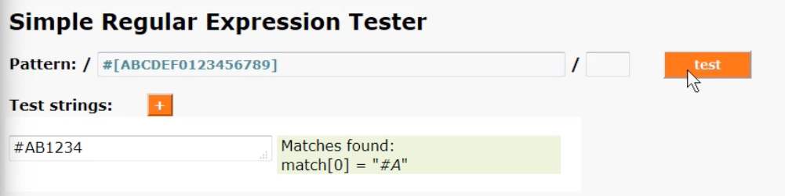

Update regex to say that more than just the first character should match. Need to use a *quantifier* character for this.

**Quantifier**

`?` Match 0 or 1 times.

`*` Match 0 or more times.

`+` Match 1 or more times.

Update regex to use the `+` quantifier:

```
/#[ABCDEF0123456789]+/
```

This time it works to match a hex color:

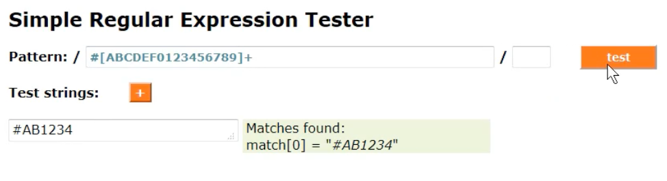

**Dash**

Simplify regex by grouping some characters together using `-`. This technique only works for sequential characters:

```
/#[A-F0-9]+/
```

Confirmed still works:

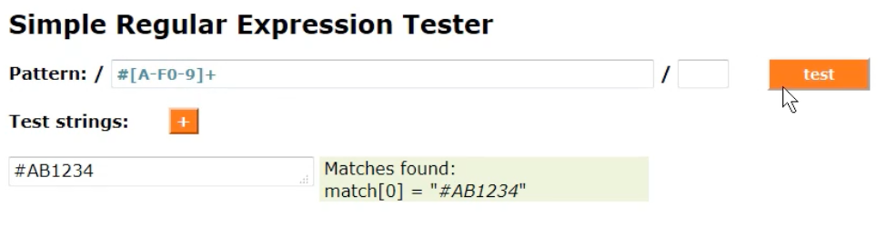

**More Testing**

If user forgets the hash, example `AB1234`, no match.

To be more forgiving, use `?` quantifier after the hash to indicate its optional:

```
/#?[A-F0-9]+/
```

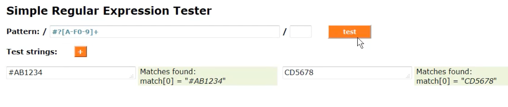

**Quantify with Specificity**

Unfortunately the current regex also matches against invalid css color codes such as `EF90` and `3F`:


Solution: Use curly braces to quantify with specificity. To indicate match exactly 6 characters, replace the `+` quantifier with `{6}`:

```
/#?[A-F0-9]{6}/
```

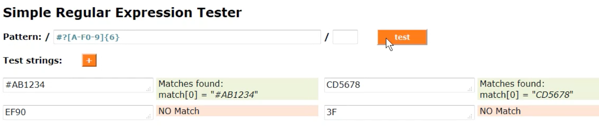

**Pipe Character OR**

But a three character code is valid! Example: `#B63`, but this won't match because current regex says it has to be exactly 6 characters.

Solution: Use pipe character `|` to indicate OR:

```
/#?[A-F0-9]{6}|[A-F0-9]{3}/
```

Creates two *branches* in the regex which are both considered valid for matching.

Above works, but for a 3 character code, does not match on the hash:


Problem is alternating branches are not limited to the character ranges with their quantifiers. So in this regex, first branch has the hash and second does not.

**Parens for Alternation**

Solution is to use parens to indicate where alternation starts and ends:

```
/#?([A-F0-9]{6}|[A-F0-9]{3})/
```

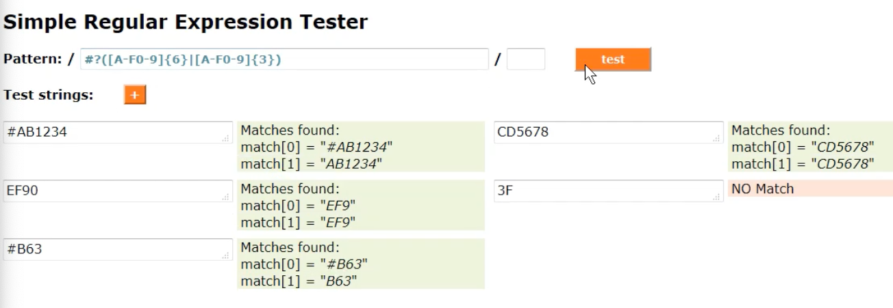

Notice that before adding the parens, the string `#B63` only returned a single match:

```
match[0] = "#B63"
```

But when parens added, get two matches - one with hash and one without:

```
match[0] = "#B63"
match[1] = "B63"
```

Adding the parens also makes the regex *remember* sub-matches. This makes match alternation sub-pattern get added to the match array.

This is useful, can use second match from array where it's known that the `#` is not included, and concatenate it back in code:


**Lower and Mixed Case**

Consider valid css color: `Ab12eF` or `87effe` - at the moment, it does not match the regex:

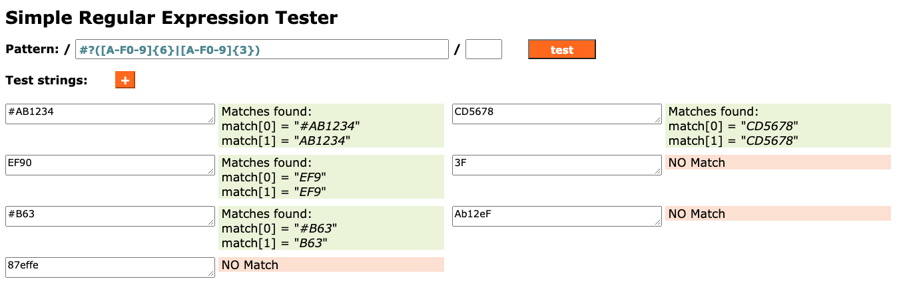

Solution 1 - add lower case range to the character class:

```
/#?([A-Fa-f0-9]{6}|[A-Fa-f0-9]{3})/
```

It works:

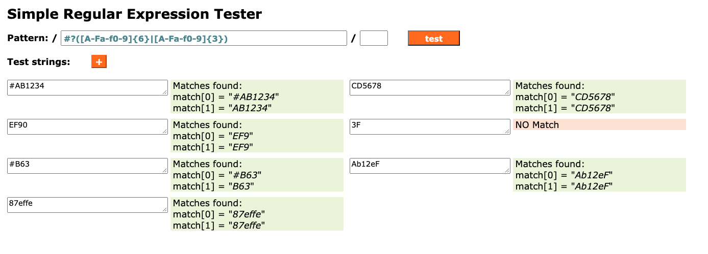

Solution 2 - add *pattern modifier* to regex. Specifically, `i` for Case Insensitive

```
/#?([A-F0-9]{6}|[A-F0-9]{3})/i
```

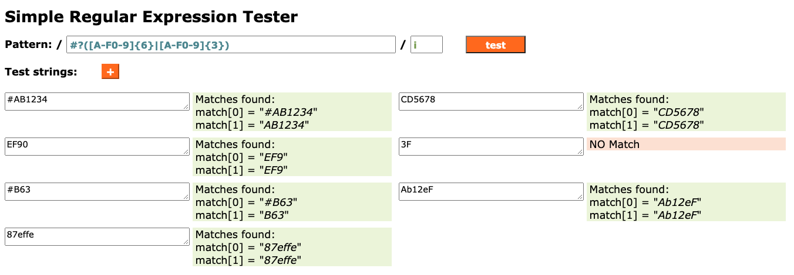

**Anchoring: Things that shouldn't match**

Test some strings that should not match:

Color name: `blue`, Not a hex code: `XYz87K`, hex code with other text appearing before: `test # ab12587` or after: `#ABCDEF123456 test`, potential hack: `<script style="color: #005599;">...</script>`.

Some of these do match:

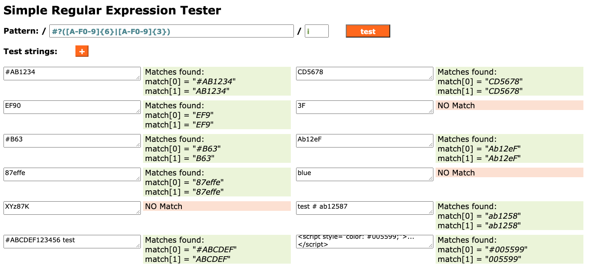

First two correctly do not match but remainder do.

Reason is regex searches *whole* string until it finds a match.

But in this case, only want to consider it a match if the complete string matches.

Solution is to *anchor* the regex to tell it that the match should start at the beginning of the input string, and end at the end of the input string.

Caret `^` anchors the regex to the beginning of string.

Dollar `$` anchors the regex to the end of string.

```
/^#?([A-F0-9]{6}|[A-F0-9]{3})$/i
```

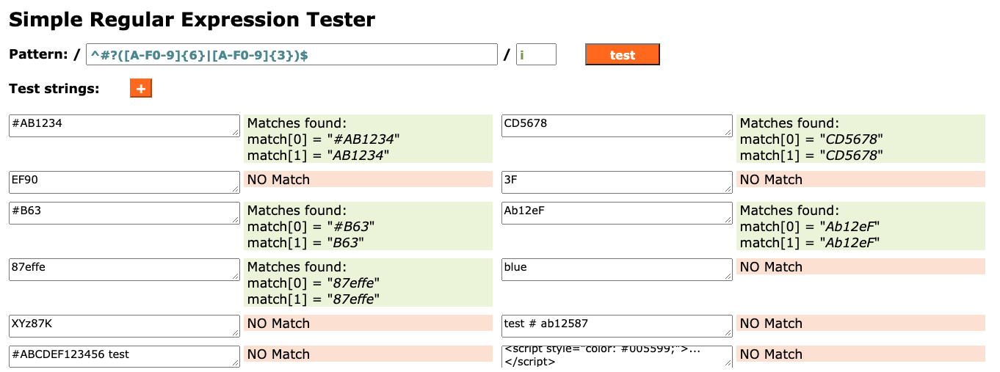

**Whitespace**

Try entering a valid hex color but with whitespace around it: `    #AbcD84    `. Does not match:

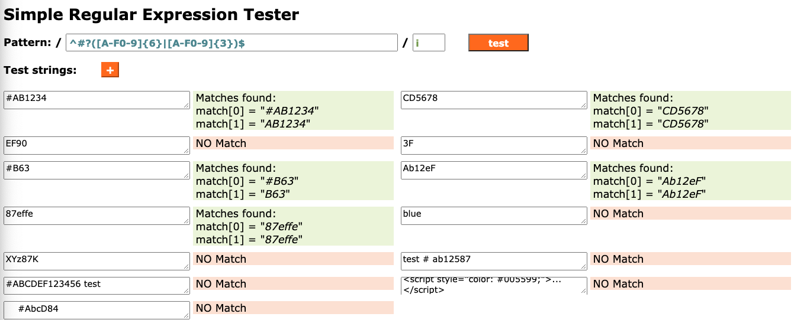

Generally its good practice to trim the whitespace in the code *before* running regex matching on it.

But it is possible to use regex to match strings with surrounding whitespace.

Examples of whitespace characters: Tab, space, newline, carriage return.

Messy solution: Add character range for each specific kind of whitespace similar to how we're using character ranges for A-F and 0-9 (didn't work for me):

```
/^[\t\f\n\r]*#?([A-F0-9]{6}|[A-F0-9]{3})[\t\f\n\r]*$/i
```

Cleaner solution: Frequently used groups of characters have *shorthand* codes. For whitespace, shorthand code is `\s`:

```
/^\s*#?([A-F0-9]{6}|[A-F0-9]{3})\s*$/i
```

Now the valid hex code surrounded by whitespace does match:

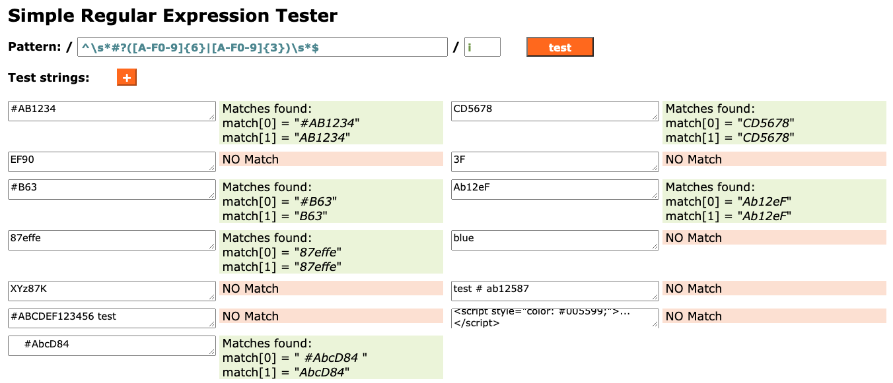

### Visualization

Here's a visual of the regex that's been built up in this module:

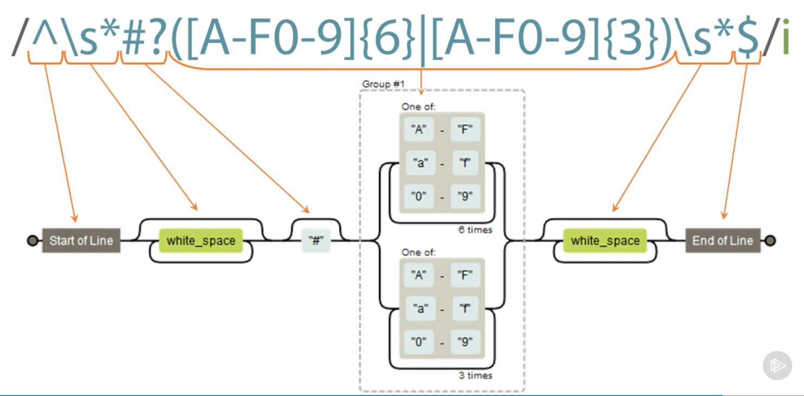

Use visualizer: https://regexper.com/

Line going through as well as around any portion of regex indicates that it's optional.

Lines loop back where character can or should be repeated.

### Basic Syntax Summary

* `?*+{#}` Quantifiers
* `[...]` Character ranges
* `\s` Shorthand character codes
* `(...|...)` Grouping and alternation
* `^...$` Anchors
* `i` Modifiers

## Syntax in Detail

**Terminology**

"Regular Expression" is *only* referring to the pattern, eg: `[a-z0-9]+`.

The pattern *may* need to be surrounded by delimeters `/`, eg: `/[a-z0-9]+/`.

*Interpretation* of the pattern may be influenced by *modifiers* (aka flags) that appear after the trailing delimeter, eg: `/[a-z0-9]+/im`.

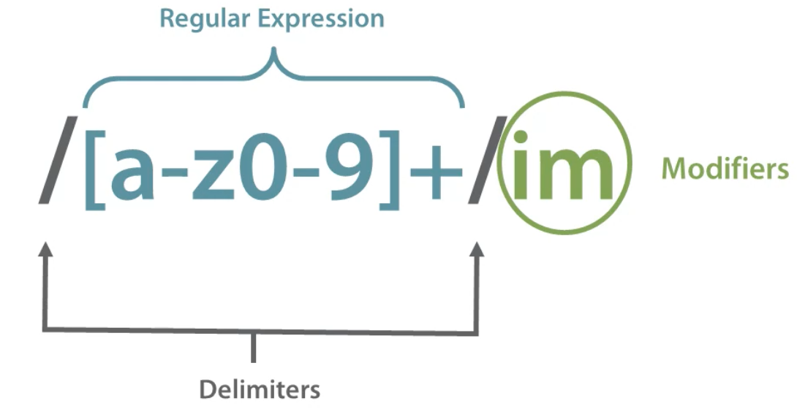

### Engines, Dialects, Influencers

Regex standards are complicated, lots of history.

Initially only supported limited syntax such as: `. \ [ ^ $ *`

Over time, more complex pattern matching was supported with: `? + ( | ) { }`

And even more complexity: `\s \d (?=...) (?:..) (?P<>...) (?#...)`

But lots of people were building these regex engines/libraries/interpreters at the same time, and each came up with their own syntaxes and matching algorithms that were slightly different than the others.

**Regex Engines**

30+ regex engines including: POSIX, PCRE, ECMAscript, Oniguruma, GRETA, DEELX, FREJ, GLib/GRegex, Pattwo, Henry Spencer's regex, Jakarta, Boost, TRE, RE2, QT, RGX, CL-PPCRE.

All have their own regex dialect.

Perl programming language made the most progress of all of these in advance pattern matching syntax.

As a result, the majority of regex engines support the PCRE standard.

**Influencers**

Result of regex influenced by several factors:

1. Regex engine: aka interpreter library.
2. Engine version: regex engine may have different versions released and be compiled with different options/flags to enable certain features.
3. Program/Programming language: regex engine is implemented in a programming language or editor or some other program. Implementation may not support all features of the regex engine. Some implementations may have added *extra features* to the engine. Some programming languages implement multiple regex engines and give programmer a choice as to which to use.
4. Version of Program/Programming language.
5. Locale of system under which program is running.
6. Compiler/interpreter of the program that is running.

**Syntax Overlap**

Due to all the above variations, it can be challenging to write portable regex.

All the regex engines overlap in their supported syntax, but all also have differences:

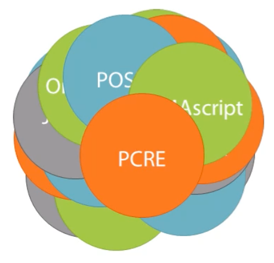

This course will focus on ~50% of the features where most engines overlap.

**Feature Availability**

See `Materials.zip` in course handout, but also double-check in regex manual for environment you're planning to use it in.

### Matching Characters

Regex contains both *special* and *ordinary* characters.

**Ordinary Characters**

Simplest, eg: `A`, `a`, `0`.

They just match themselves, eg: regex `abc` will match `abcdefghijklmnopqrstuvwxyz`.

BUT using a regex to match only a literal string is not efficient. Most programming languages will have a better suited method to do this.

**Control/Non-Printing Characters**

Can also be matched in the same way as literal/ordinary characters:

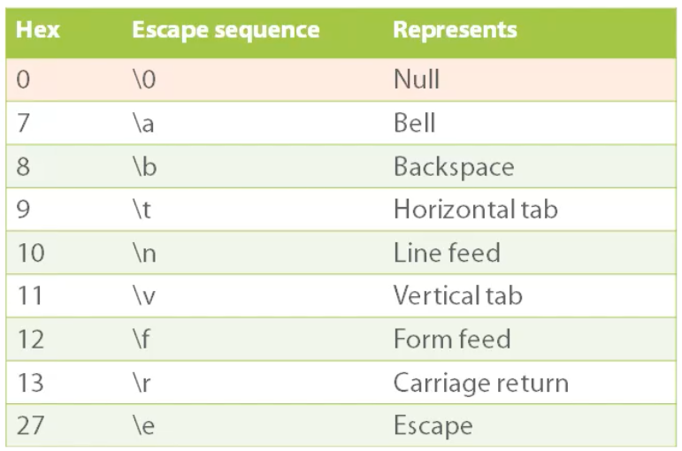

WATCH OUT: Not all of these may be supported in all programming environments.

**Control Sequences**

* `\cX` Control sequences
* `\XXX`, `\0XX` Octals
* `\xHH`, `\x{HHHH}` Hex codes
* `\uHHHH`, `\u{H...}` Unicode codepoints

WATCH OUT: Not all of these may be supported in all programming environments.

**Pitfalls**

Recall `\s` in earlier demo, shorthand for whitespace.

There's also `\R` for Unix/Mac/Windows line endings.

Usually the shorthand codes are different than control characters.

Except `\b`: This means backspace as a control character. If you need to match literal backspace, use it in a character class: `[\b]`. Could also use hex or octal sequence for backspace character.

Null byte `\0` may not work, use the hex escape sequence instead `\x00`

### Meta Characters - Character Classes

Characters with special meaning.

**Character Classes - Positive**

Character classes are enclosed in square brackets `[...]`

Can specify individual characters or dashes to indicate a range.

Can combine multiple ranges and literals in a single character class.

* `[abcdef]`
* `[a-f]`
* `[a-f_%0-9]`

Character class means: Any of the characters contained in the square brackets is considered a match.

**Character Classes - Negative**

Can also invert by adding a caret `^` at beginning of character class:

* `[^abcdef]`
* `[^a-f]`
* `[^a-f_%0-9]`

This means: Match anything *except* the characters contained in the character class.

Example using: http://myregexp.com/

Suppose the Subject text contains a list of items and prices and we want to match only the prices:

```
Hair cut         $25
Cut & wash       $40
Hair colouring   $70
Shave            $15
```

Regex to match prices: `[$0-9]+`

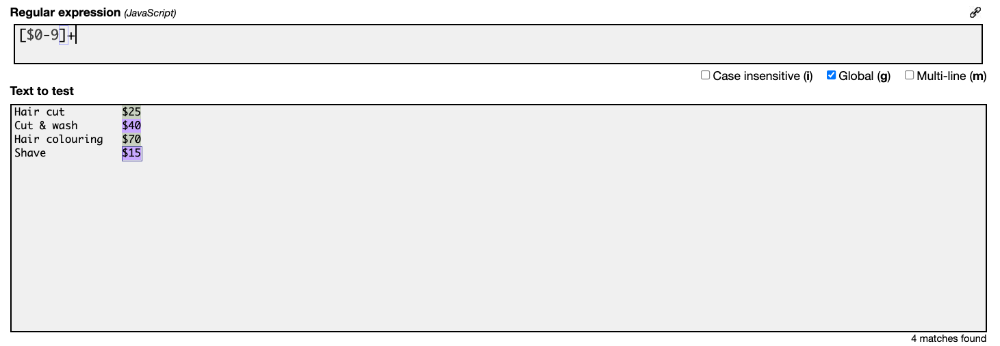

If add caret in front of character class, will match all but the prices `[^$0-9]+`

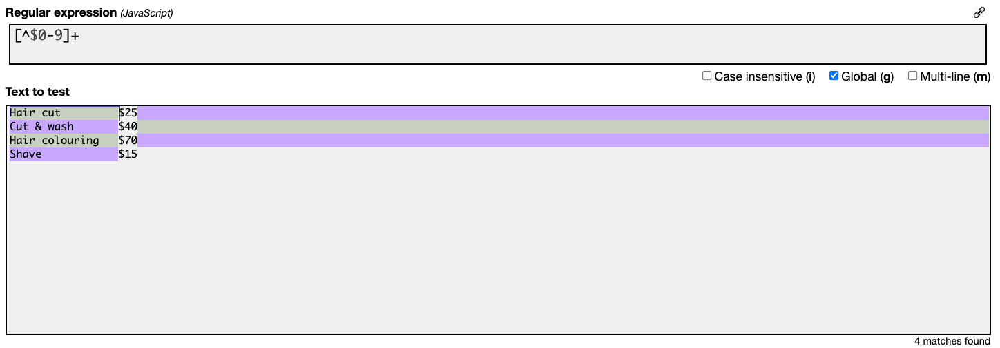

**Matching Special Characters**

How to match a literal dash `-` within a character class?

Place it at the very beginning or end of the character class and it will be treated as a literal: `[A-Za-z_-]`

To use dash within a range, to start range with a dash, that range must be the first range in character class: `[--/A-Z]`.

To end range in dash, the range can appear anywhere in character class: `[A-Z+--]`.

Matching a literal `^` works similarly, but do not place it as first character: `[A-Za-z^]`.

To match literal square brackets `[` or `]` - place as first character or escape them: `[[]`, `[A-Z\[]`, `[A-Z\]`

**Character Class Watch Out**

Character ranges usually follow order of locale/collation program is running under.

Example using [ASCII character table](https://www.asciitable.com/).

Using range `[A-Z]` behaves as expected, only matching characters A, B, C,...Z

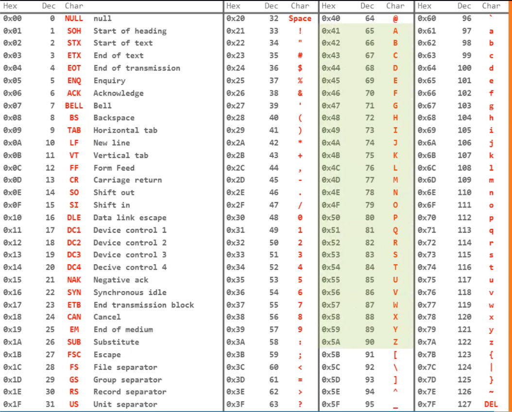

But using range from upper A to lower Z `[A-z]` will match some other characters that are in the ASCII order including `[`, `\`, `]`:

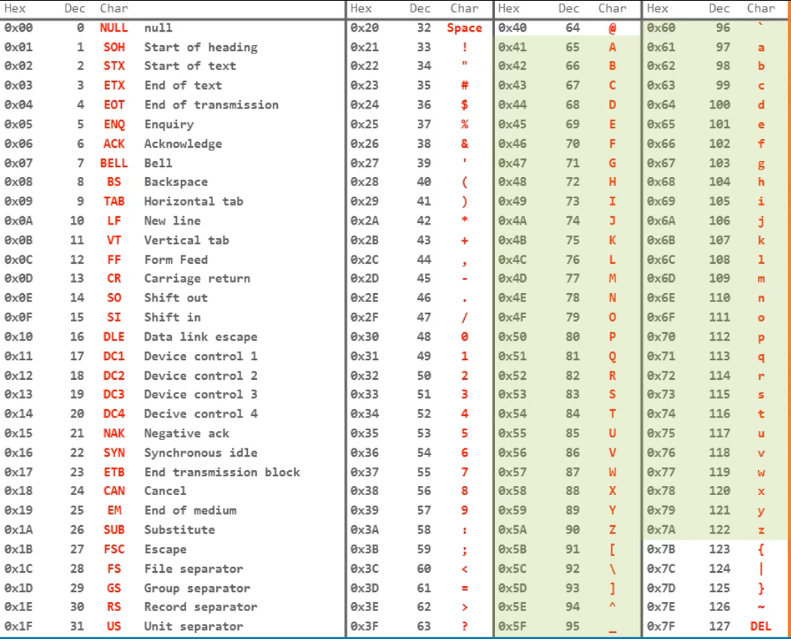

Careful as to order of how range is defined, eg: `[0-9]` works as expected, but `[9-0]` is not well defined and may either be considered invalid or not match anything.

Empty lists `[]` and lists missing closing bracket `/[/` are invalid.

### Meta Characters - Wildcard

Wildcard in regex is the dot character `.`.

Dot (usually) matches any character except new line.

When dot is used within a character class, it becomes a literal dot, no longer a wildcard.

**Pitfalls**

Need to be aware of which flavor of regex is being used as it affects dot behaviour.

In some implementations it does not match carriage return.

In `awk`, dot matches anything but the null byte.

`.` together with `+` quantifier will be slow.

### Meta Characters - Quantifiers and Greediness

Four different ways to indicate repetition. Three of which are single character quantifiers:

1. `?` Zero or one times, i.e. "maybe" match
2. `+` One or more times, i.e. repeat as often as possible but at least once
3. `*` Zero or more times, i.e. repeat as often as possible, but also accept no matches

Fourth type of quantifier allows for more precision. Can specify exact quantity to match or ranges to indicate min and max quantities to match:

4. `{}`
   1. `{n}` Exactly `n` times
   2. `{n,}` `n` or more times. Like `+` and `*`, will try to match as often as possible.
   3. `{n,m}` Between `n` and `m` times
   4. `{,m}` Between 0 and m times (same as `{0,m}`).

**WATCH OUT**

`{,m}` not available in all implementations, best practice is to use more widely supported syntax `{0,m}`.

**Scope**

Quantifier applies to a "unit", where a unit is a single part of the regex pattern that immediately precedes the quantifier.

A unit could be for example:

* String literal `abcd+`: Quantifier applies to `abcd`
* Character class `[ab]*cd`: Quantifier applies to `[ab]`
* Group `a(b|c)?d`: Quantifier applies to `(b|c)`

**Greediness**

`+`, `*`, and `{n,}` All try to match as often as possible. i.e. they look for max allowed repetition, and fall back to less repetition only if matching on the maximum repetition would prevent getting a match for entire regex.

Regex always favors a match over a non-match.

Regex always tries to match as often as possible.

**Greediness and Backtracing**

Using: https://regex101.com/

Consider subject text:

`We take one step forward, two steps back`

Regex is processed from left to right.

Starts by matching first character in pattern against first possible location in input string.

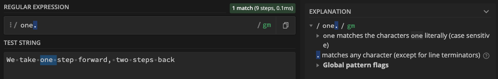

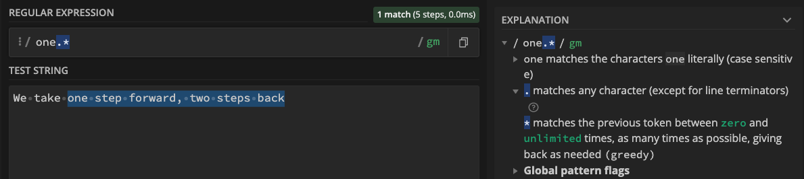

Then moves on to next character in pattern and tries to match that against previously matched character in input string

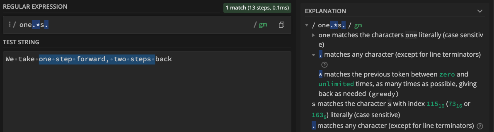

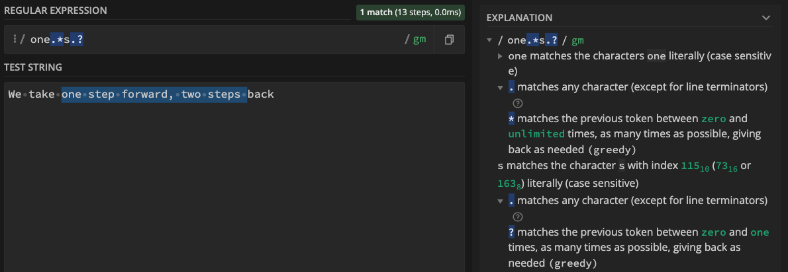

If a character is encountered in pattern where it can't match against previously character in input string, it moves further back in input string to see if it can find the pattern so that the currently encountered portion of regex matches as well, i.e. *backtracing*.

Notice how adding a `t` at end of pattern makes the current match "move back":

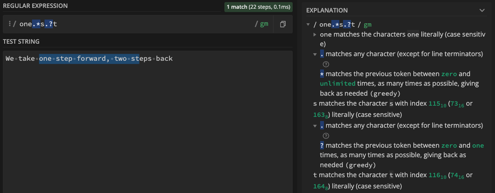

Now adding `[a-z]` (i.e. match a single character in range a - z) followed by `+` quantifier moves forward:

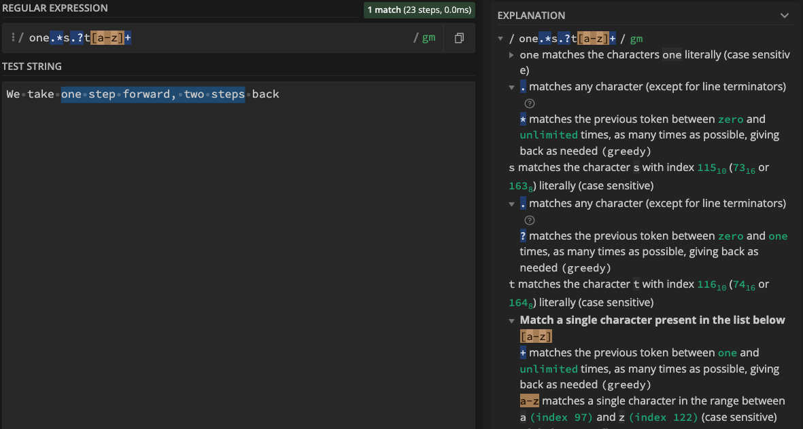

But adding literal `p` character to regex makes it "move back" in the match:

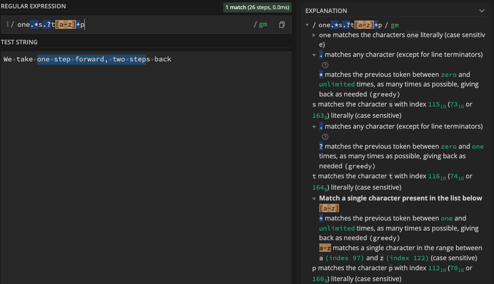

When regex engine encounters a quantifier, it "searches forward" matching as much as possible.

When engine then encounters a pattern that doesn't match in currently matched portion of string, it "goes back" until if finds a position in which it does match. For example, adding a literal space character to our current regex, notice the match goes back to `one step ` in subject text:

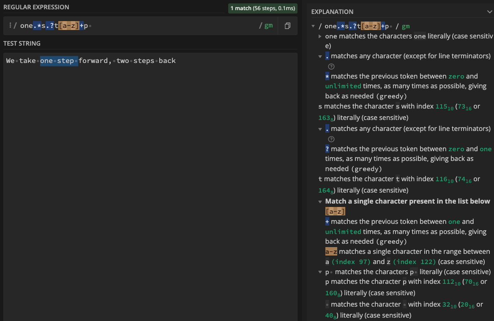

Next time engine encounters a quantifier, repeats the process of searching forward as much as possible, then step-by-step go back as it encounters other characters in pattern that may not match what's been matched so far in the going forwards step.

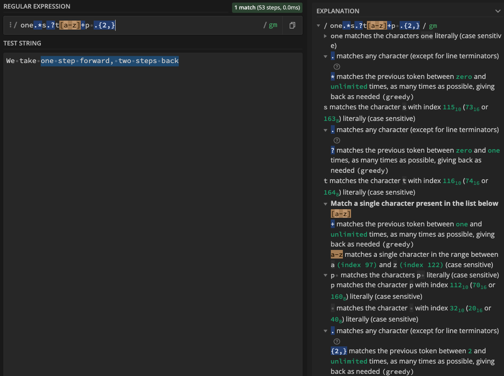

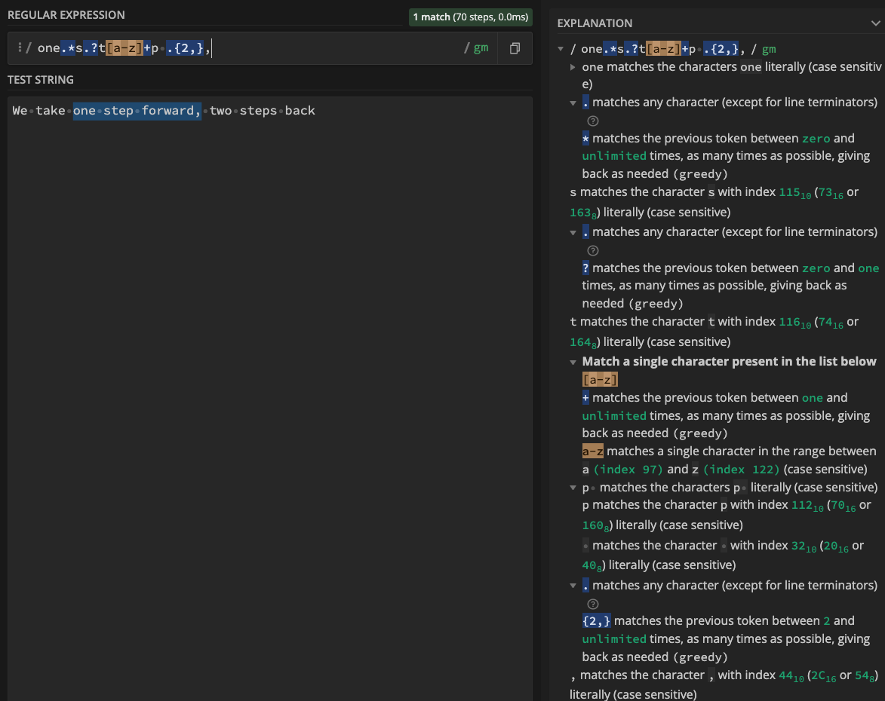

**Performance**

Frequent backtracing (stepping back from greedy quantifier match to match next part of pattern) can slow down the matching because engine needs to go over string multiple times.

For small string, not an issue. But for large input text and/or complex pattern, will be noticeably slow to match.

Left at 3:34