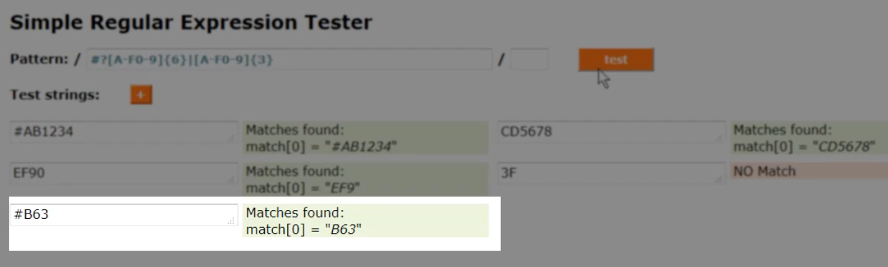
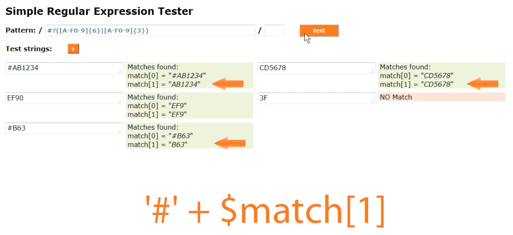

<!-- START doctoc generated TOC please keep comment here to allow auto update -->
<!-- DON'T EDIT THIS SECTION, INSTEAD RE-RUN doctoc TO UPDATE -->
**Table of Contents**  *generated with [DocToc](https://github.com/thlorenz/doctoc)*

- [Regular Expression Fundamentals](#regular-expression-fundamentals)
  - [References](#references)
  - [Fundamentals](#fundamentals)
    - [Definition](#definition)
    - [How It Works](#how-it-works)
      - [1. Pattern](#1-pattern)
      - [2. Regex](#2-regex)
      - [3. Subject and Function](#3-subject-and-function)
      - [4. Engine](#4-engine)
  - [Building Your First Regex](#building-your-first-regex)
    - [Visualization](#visualization)
    - [Basic Syntax Summary](#basic-syntax-summary)
  - [Syntax in Detail](#syntax-in-detail)

<!-- END doctoc generated TOC please keep comment here to allow auto update -->

# Regular Expression Fundamentals

> My notes from Pluralsight [course](https://app.pluralsight.com/library/courses/regular-expressions-fundamentals/table-of-contents)

## References

Visualizer: https://regexper.com/

Tester one at a time: https://www.regextester.com/

Tester multiple: https://regexr.com/

Best: Proprietary html/js tool provided by instructor in Exercise files.

## Fundamentals

### Definition

A sequence of characters that define a search pattern.

Focus on "pattern recognition", eg of patterns:

* car license plates
* support ticket numbers
* postal codes
* dates
* email addresses
* url
* airport codes
* bar codes
* credit card numbers
* bank account numbers
* addresses
* country codes

**Typical Uses**

* input validation
* search/replace
* string parsing
* data scraping
* syntax highlighting
* data mapping

To perform above, need to be able to transform patterns in data into regular expressions.

**Users of Regex**

* developers working with strings in IDEs
* data professionals to query data
* sysadmins working with file system, server directives

Supported by pretty much every programming language (exception Assembly).

**Regex Standards**

* POSIX: Portable Operating System Interface for uniX
* BRE (POSIX): Basic Regular Expressions
* ERE (POSIX): Extended Regular Expressions
* PCRE: Perl Compatible Regular Expressions

### How It Works


#### 1. Pattern

First need to determine the Pattern that you want to match. May need to read docs, RFC's, legal docs to figure out what the rules are.

Eg: What are the pattern rules for an email address?

Numerous RFCs that define composition of email address including: 821, 822, 1035, 1123, 2142, 2821, 2822, 3696, 4291, 5321, etc. Potentially some have conflicts with each other. Have to know which RFC supersedes the other in case of a conflict.

#### 2. Regex

Second, translate the pattern rules into a Regex pattern. Need to decide how far the regex will go in matching some or all of pattern rules.

Example of email matching regex meeting rules of RFC 5321:


Above matches many edge cases defined in RFC, but that are rarely encountered in actual in the real world.

Another option would be to use a simpler regex that doesn't catch all edge cases.

Example, this one is just basic email validation, does not allow i8n domains, but is flexible for new TLDs:


The simpler regex is "good enough", and more maintainable.

#### 3. Subject and Function

Third, send some sample text (string or group of strings) to be tested, called the "Subject" or Input, and the Regex defined in previous step into a Function.

The Subject could be any data source such as input from a form, result of database query or API call, info from a file system, etc.

Note that regex was originally defined for "regular languages", may not work so well in [ideographic based languages](https://dailyjustnow.com/en/what-is-an-ideographic-language-25317/), eg: Chinese, Japanese. But last few years have improved unicode support.

#### 4. Engine

The Function (which receives a test Subject and Regex pattern) goes to the regex Engine. The Engine compiles the Regex, evaluates the Subject (string) against the Regex, and returns a result to the Function, which in turn returns that Result to the caller of the Function.

**Result Types**

The type of result used depends on the Function used. The result type could be one of:

* Boolean: Does it match?
* Integer: How many matches have been found?
* Array: What are the matches?

How about position of match(es)?

## Building Your First Regex

Example: Building a CMS that allows user to change background color of pages. CSS color example: `#eded84`, which would come from a color picker component. Want to validate that the color string received from picker component is a valid CSS color/hex value.

**The Pattern**

Generally a CSS color code using hex notation:

* starts with a hash
* followed by 6 characters
* each character must be in range A through F, and/or 0 through 9
* 3 sets of two character codes build up the Red, Green, and Blue values


`#AB1234`

**Regex**

Every combination between # and 0 repeated 6 times and F repeated 6 times is valid.

Regex based on this pattern:

```
/#[ABCDEF0123456789]/
```

Square brackets used to group a *range* of acceptable characters.

Forward slashes are *delimiters* to indicate the start and end of the regex.

Testing this on subject `#AB1234` only matches on `#A`:


Update regex to say that more than just the first character should match. Need to use a *quantifier* character for this.

**Quantifier**

`?` Match 0 or 1 times.

`*` Match 0 or more times.

`+` Match 1 or more times.

Update regex to use the `+` quantifier:

```
/#[ABCDEF0123456789]+/
```

This time it works to match a hex color:


**Dash**

Simplify regex by grouping some characters together using `-`. This technique only works for sequential characters:

```
/#[A-F0-9]+/
```

Confirmed still works:


**More Testing**

If user forgets the hash, example `AB1234`, no match.

To be more forgiving, use `?` quantifier after the hash to indicate its optional:

```
/#?[A-F0-9]+/
```


**Quantify with Specificity**

Unfortunately the current regex also matches against invalid css color codes such as `EF90` and `3F`:


Solution: Use curly braces to quantify with specificity. To indicate match exactly 6 characters, replace the `+` quantifier with `{6}`:

```
/#?[A-F0-9]{6}/
```


**Pipe Character OR**

But a three character code is valid! Example: `#B63`, but this won't match because current regex says it has to be exactly 6 characters.

Solution: Use pipe character `|` to indicate OR:

```
/#?[A-F0-9]{6}|[A-F0-9]{3}/
```

Creates two *branches* in the regex which are both considered valid for matching.

Above works, but for a 3 character code, does not match on the hash:



Problem is alternating branches are not limited to the character ranges with their quantifiers. So in this regex, first branch has the hash and second does not.

**Parens for Alternation**

Solution is to use parens to indicate where alternation starts and ends:

```
/#?([A-F0-9]{6}|[A-F0-9]{3})/
```


Notice that before adding the parens, the string `#B63` only returned a single match:

```
match[0] = "#B63"
```

But when parens added, get two matches - one with hash and one without:

```
match[0] = "#B63"
match[1] = "B63"
```

Adding the parens also makes the regex *remember* sub-matches. This makes match alternation sub-pattern get added to the match array.

This is useful, can use second match from array where it's known that the `#` is not included, and concatenate it back in code:



**Lower and Mixed Case**

Consider valid css color: `Ab12eF` or `87effe` - at the moment, it does not match the regex:


Solution 1 - add lower case range to the character class:

```
/#?([A-Fa-f0-9]{6}|[A-Fa-f0-9]{3})/
```

It works:


Solution 2 - add *pattern modifier* to regex. Specifically, `i` for Case Insensitive

```
/#?([A-F0-9]{6}|[A-F0-9]{3})/i
```


**Anchoring: Things that shouldn't match**

Test some strings that should not match:

Color name: `blue`, Not a hex code: `XYz87K`, hex code with other text appearing before: `test # ab12587` or after: `#ABCDEF123456 test`, potential hack: `<script style="color: #005599;">...</script>`.

Some of these do match:


First two correctly do not match but remainder do.

Reason is regex searches *whole* string until it finds a match.

But in this case, only want to consider it a match if the complete string matches.

Solution is to *anchor* the regex to tell it that the match should start at the beginning of the input string, and end at the end of the input string.

Caret `^` anchors the regex to the beginning of string.

Dollar `$` anchors the regex to the end of string.

```
/^#?([A-F0-9]{6}|[A-F0-9]{3})$/i
```


**Whitespace**

Try entering a valid hex color but with whitespace around it: `    #AbcD84    `. Does not match:


Generally its good practice to trim the whitespace in the code *before* running regex matching on it.

But it is possible to use regex to match strings with surrounding whitespace.

Examples of whitespace characters: Tab, space, newline, carriage return.

Messy solution: Add character range for each specific kind of whitespace similar to how we're using character ranges for A-F and 0-9 (didn't work for me):

```
/^[\t\f\n\r]*#?([A-F0-9]{6}|[A-F0-9]{3})[\t\f\n\r]*$/i
```

Cleaner solution: Frequently used groups of characters have *shorthand* codes. For whitespace, shorthand code is `\s`:

```
/^\s*#?([A-F0-9]{6}|[A-F0-9]{3})\s*$/i
```

Now the valid hex code surrounded by whitespace does match:


### Visualization

Here's a visual of the regex that's been built up in this module:


Use visualizer: https://regexper.com/

Line going through as well as around any portion of regex indicates that it's optional.

Lines loop back where character can or should be repeated.

### Basic Syntax Summary

* `?*+{#}` Quantifiers
* `[...]` Character ranges
* `\s` Shorthand character codes
* `(...|...)` Grouping and alternation
* `^...$` Anchors
* `i` Modifiers

## Syntax in Detail